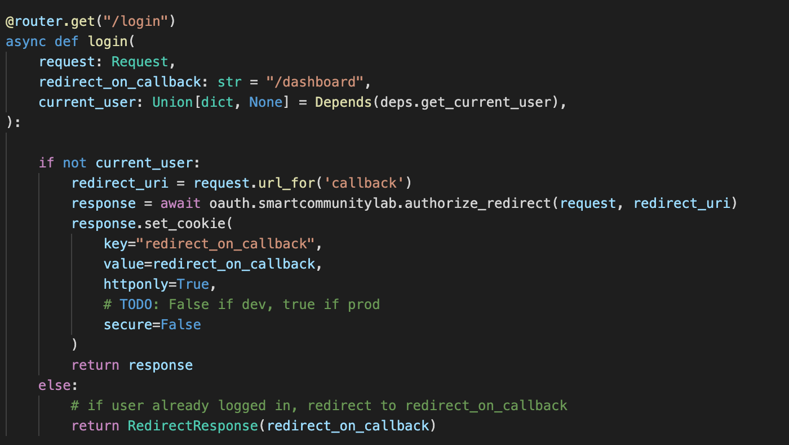
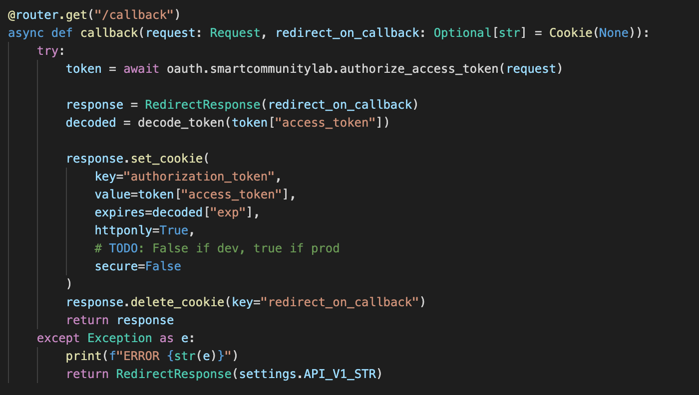
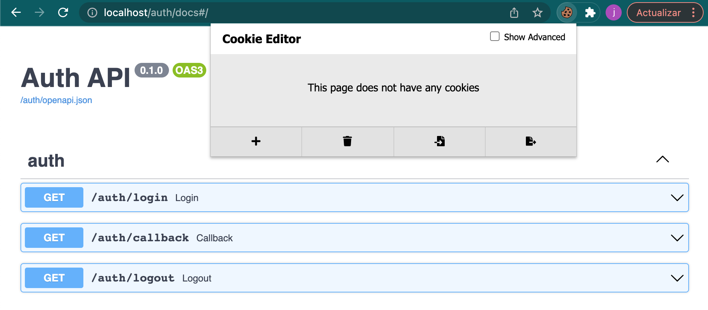
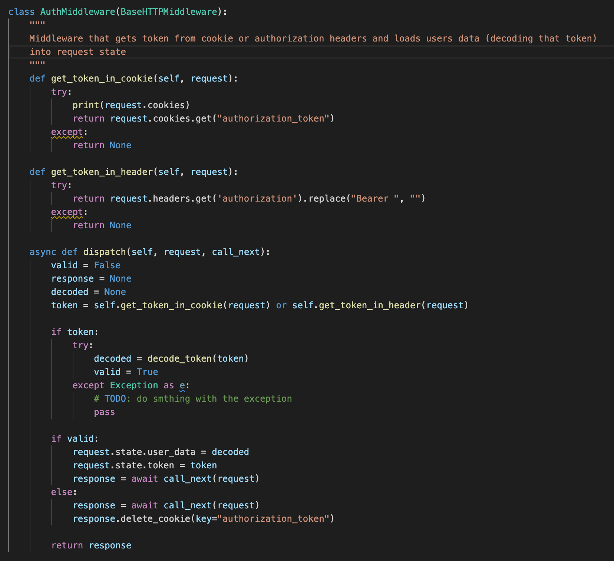
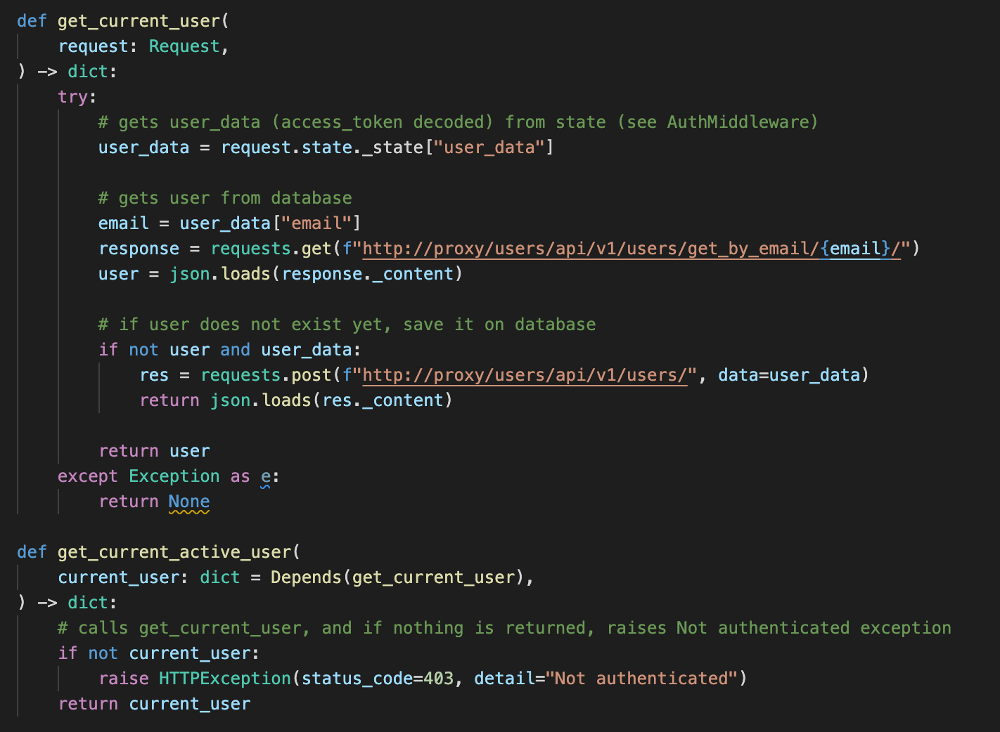
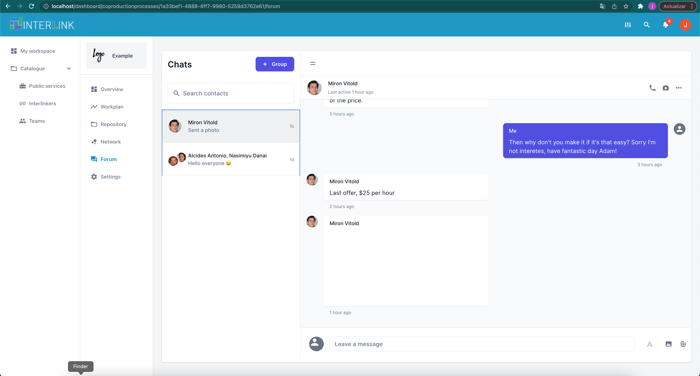
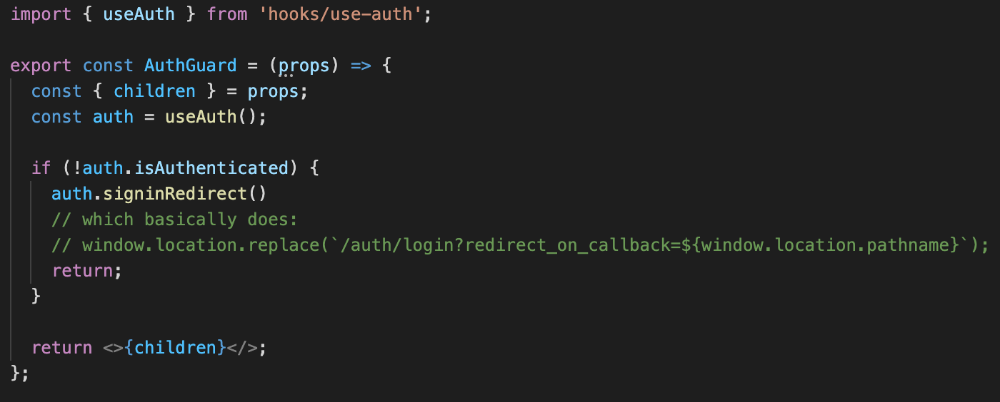

## How is authentication achieved?
### Auth microservice

This authentication is managed by **auth** microservice, that exposes these endpoints:
* /auth/login: redirects to the OIDC provider frontend, where the users can log in. Accepts *redirect_on_callback*, which is set to a cookie.



* /auth/callback: callback for the OIDC provider, gets tokens returned by the OIDC provider and sets the access_token to *auth_token* cookie [samesite](https://developer.mozilla.org/en-US/docs/Web/HTTP/Headers/Set-Cookie/SameSite). Then, redirects the browser to the path specified by the *redirect_on_callback* cookie after deleting it.



* /auth/logout: deletes *auth_token* and redirects browser to / , where main frontend is located.


### Flow

1. User has not logged in yet (there is no cookie).

  

2. After making a GET request to /auth/login, if user is not logged in, browser redirects to the OIDC service where the user can log in with credentials or third party providers, such as Google.

  

3. After a successful login, token is stored as a "samesite" cookie. Now, all requests made to the backend microservices behind **localhost** (or the site where is running the **auth** microservice) send the cookie together with the request.

  


### How do microservices check that a request is authenticated?


* All logic microservices (auth, coproduction, users, catalogue) must integrate an **AuthMiddleware**. 

  

* This middleware checks if the access token is present **as a cookie or as an authorization header** (being prioritized the cookie), checks its validity and decodes it to set the *user_data* (contained inside the access token, having name, email and profile image, for example) inside **request** data

  

* Endpoints of the all microservices (given /coproduction/api/v1/coproductionprocesses as an example) look inside request data to get the *user_data* and send a request to the **users** microservice, in order to get all the information of the user (user database model, that includes  data regarding business logic)

  
  

> :warning: **Currently, this microservices are developed with FastAPI framework (with python), and the middleware developed for it is located at /backend/common/authentication.** It is assumed that this logic can be reimplemented in any other framework.


## Advantages and drawbacks of cookie authentication


To understand the advantages of this authentication we must really understand how the different services are integrated in the frontend. If we look again at the example of how the interlinker **forum** is integrated into the frontend, we will see that it is done through an iframe that loads the path "/forum/api/v1/assets/{id}/gui".



```
<iframe src="/forum/api/v1/assets/{id}/gui" frameBorder="0"></iframe>
```
If authentication through headers was used, we would have two alternatives:

* That each service / interlinker integrate its own authentication flow (being complex both to develop and maintain). Likewise, it would entail that the user had to perform the login steps for and for each of the external services that are being injected into the main frontend. **In fact, it would not be possible, because the OIDC provider does not support its loading inside an iframe**.

* We should find a plausible way to pass the access token to the service contained in the iframe. One way to do this would be to inject it as a parameter in the iframe's src, which would expose the token:

```
<iframe src="/forum/api/v1/assets/{id}/gui?access_token={access_token}" frameBorder="0"></iframe>
```

#### Advantages:

  * Once a user has logged in once, through any service (main frontend or interlinker GUIs), ALL services can make authenticated requests.
  * Logic to implement authentication in any service is trivial and **not framework-dependant**. Given **forum** interlinker as an example, which is developed with NextJS framework, the logic to authenticate an user would be as simple as:

  

  (being *auth* object an user_data "storage object" in order to to access it fastly)

  * By the way, **authentication through authorization headers is also allowed (check AuthMiddleware)**

  Drawbacks:
  
  * All services MUST BE behind the same sitename (being allowed subdomains). Locally, this is achieved by the **proxy** microservice, powered by Traefik (take a look in [ARCHITECTURE.md](ARCHITECTURE.md)).
    * MAIN FRONTEND: http://localhost/
    * BACKEND MICROSERVICES:
      * Auth microservice: http://localhost/coproduction (most important because is the service that sets the cookie)
      * Coproduction microservice: http://localhost/coproduction
      * Users microservice: http://localhost/users
      * Catalogue microservice: http://localhost/catalogue
    * INTERLINKERS:
      * Forum microservice: http://localhost/forum
      * Googledrive microservice: http://localhost/googledrive
      * Filemanager microservice: http://localhost/filemanager
      ...