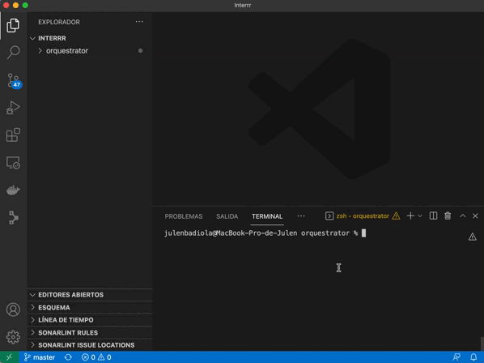

<div id="top"></div>

<!-- PROJECT LOGO -->
<br />
<div align="center">

  <h3 align="center">Interlink collaborative environment orquestrator</h3>

  <p align="center">
    <a href="https://interlink-project.eu/"><strong>View Interlink project »</strong></a>
    <br />
    <br />
    <a href="https://github.com/interlink-project/backend/issues">Report Bug</a>
    ·
    <a href="https://github.com/interlink-project/backend/issues">Request Feature</a>
  </p>
</div>


<!-- ABOUT THE PROJECT -->
## About the project

This project is intended to be the orquestrator to create the structure of directories that runs the collaborative environment

<!-- GETTING STARTED -->
## Getting Started

To get a local copy up and running follow these simple example steps.

### Prerequisites

* Install [docker-compose](https://docs.docker.com/compose/install/) to run this project.

### Installation

1. Setup the project 

    * linux or macOS: 

    ```sh
    make setup
    ```
    
    
    * windows: *soon*

1. Build all components

    * linux or macOS:
    
    ```sh
    make build
    ```

    * windows: *soon*

1. Run all the components integrated

    * linux or macOS: 
    
    ```sh
    make up
    ```

    * windows: *soon*

  **How is this done?**

  Take a look at the Makefile and inside *interlinker-* folders (relative to interlinker components); there, you will see three docker-composes:

  1. **docker-compose.yml**: Production ready containers
    
    docker-compose up
  
  would run containers in production mode

  1. **docker-compose.integrated.yml**: Development containers that use traefik-public network (adding traefik labels to enable routing and load balancing)

    docker-compose -f docker-compose.yml -f docker-compose.integrated.yml up 
  
  would run containers in development mode, but implementing *traefik-public* network and labels

  1. **docker-compose.solodev.yml**: Development containers for solo-development.  
  
    docker-compose -f docker-compose.yml -f docker-compose.solodev.yml up
  
  would run containers in standalone development mode

<p align="right">(<a href="#top">back to top</a>)</p>

* [AUTHENTICATION.md](AUTHENTICATION.md)
* [ARCHITECTURE.md](ARCHITECTURE.md)
* [DATA_MODEL.md](DATA_MODEL.md)
* [INTERLINKERS.md](INTERLINKERS.md)
* [TECHNOLOGIES.md](TECHNOLOGIES.md)
* [MONITORING.md](MONITORING.md)