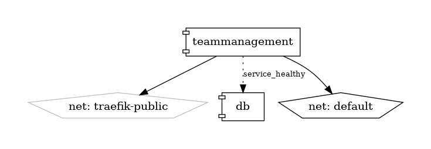
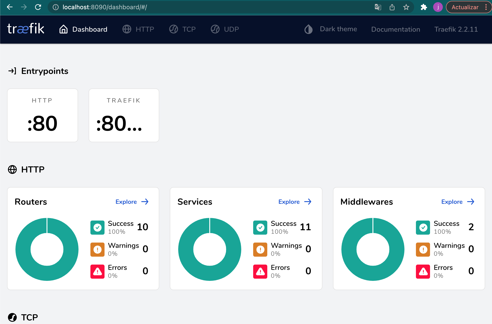

## Backend microservices
* **auth**: 
  * Docs: http://localhost/auth/docs
  * Models: none
  * Dependencies: **db** running
  * Docker-compose diagram:


* **teammanagement**: 
  * Docs: http://localhost/teammanagement/docs
  * Models: *teams, memberships*
  * Dependencies: **db** running
  * Docker-compose diagram:



* **catalogue**:
  * Docs: http://localhost/catalogue/docs
  * Models: artefact, interlinker, publicservice, rating, questioncomment, functionality, problemdomain
  * Dependencies: **db** running
  * Docker-compose diagram:


* **coproduction**:
  * Docs: http://localhost/coproduction/docs
  * Models: asset, task, taskinstantiation, phase, phaseinstantiation, objective, objectiveinstantiation, coproductionprocess, coproductionschema
  * Dependencies: **catalogue** healthy, **redis** running
  * **redis**: as message broker for coproduction and coproductionworker microservices
  * Docker-compose diagram:


* **coproductionworker**: uses **Celery**, a task queue implementation for Python web applications used to asynchronously execute work outside the HTTP request-response cycle. This service can import and use models and code from the rest of the coproduction microservice selectively to run repetetive or concurrent tasks.
  * https://medium.com/swlh/python-developers-celery-is-a-must-learn-technology-heres-how-to-get-started-578f5d63fab3


## Routing

Load balancing and reverse proxy with **Traefik** (http://localhost:8090/dashboard/). 



Traefik is an open-source reverse proxy and load balancer. The router provides a reload-less reconfiguration, metrics, monitoring and circuit breakers that are essential when running microservices. 

Unlike Nginx and HAProxy, Traefik is more suitable for application scenarios that require service discovery and service registration. For example, Traefik and Docker are very easy to combine, only need to specify the label (see "How are this interlinkers integrated?" section). 

It also integrates nicely with **Let's Encrypt** to provide SSL termination as well as infrastructure components such as Kubernetes, Docker Swarm or Amazon ECS to automatically pick up new services or instances to include in its load balancing.

As you can see in the *docker-compose.integrated.yml*, traefik (**proxy** microservice) routes all containers that specify the *traefik enable* tag and belong to the *traefik-public* network. 

For example, redirects all traffic with "/auth" prefix to the port where auth container is running. This allows to integrate new components in a very easy way.

```
labels:
  - traefik.enable=true
  - traefik.docker.network=traefik-public
  - traefik.http.routers.interlink-auth-http.rule=PathPrefix(`/auth`)
  - traefik.http.services.interlink-auth.loadbalancer.server.port=${PORT}
  - traefik.http.routers.interlink-auth-http.middlewares=auth-stripprefix
  - traefik.http.middlewares.auth-stripprefix.stripprefix.prefixes=/auth
```


### Result
* **MAIN FRONTEND:** http://localhost/
* **BACKEND MICROSERVICES:**
  * Auth microservice: http://localhost/coproduction (most important because is the service that sets the cookie)
  * Coproduction microservice: http://localhost/coproduction
  * Users microservice: http://localhost/users
  * Catalogue microservice: http://localhost/catalogue
* **INTERLINKERS:**
  * Forum microservice: http://localhost/forum
  * Googledrive microservice: http://localhost/googledrive
  * Filemanager microservice: http://localhost/filemanager
  ...