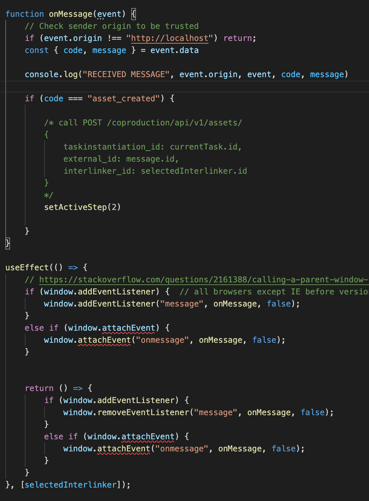

## Interlinkers (interlinkers.docker-compose.yml)
This project is intended to sum up the different interlinkers developed for the project. But, ¿what is an interlinker?

An *interlinker* is a tool that is used to create assets by *instantiating* them. These interlinkers can be classified by its *nature*: **software** or **knowledge**.

* **Software interlinkers**:

  Are software based interlinkers that create assets. For example, **forum** interlinker can be instantiated to create a forum where users can create channels and send messages. This "forum instance" is called an "asset". 

* **Knowledge interlinkers**:
  
  Refer to assets made by users that can be used as templates. For example, an user can create a google drive word document using **googledrive** interlinker and add some text to it. Now, the user this document could be reused, as if it was a template. 

  A knowledge interlinker points to the interlinker used to create an asset (backend) and the id of the specific asset that should be cloned (genesis_asset_id). 

  

### Regarding software interlinkers... how are they integrated? are all them built with the same technologies?

No. Each interlinker is treated as an independent component, so they can be developed with any framework or tool (MEAN, MERN, django, NextJS... the possibilities are infinite). 

## API Endpoints needed for SOFTWARE INTERLINKERS integration

1. **Asset instantiator GUI:** GET 

    * **WHAT:** basic GUI por asset instantiation. This is gonna be iframed.
    * **Method:** GET
    * **URL:** /*interlinker_name*/api/v1/assets/instantiator/
    * Examples:
      * googledrive interlinker: file input
      * survey: form drag and drop creator
      * etherpad: text input for specifying a name

2. **Delete existing asset:** 

    * **WHAT:** deletes assets by id
    * **Method:** DELETE
    * **URL:** /*interlinker_name*/api/v1/assets/{id}

3. **Shows GUI for given asset:** 

    * **WHAT:** shows GUI for given asset.
    * **Method:** GET
    * **URL:** /*interlinker_name*/api/v1/assets/{id}/gui/
    * Examples:
      * googledrive interlinker: redirects to Google Drive document
      * forum: renders GUI developed with react
      * etherpad: renders an iframe that shows etherpad GUI running in a diferent location (such as /etherpad/p/{padID})

4. [OPTIONAL] **Clones asset:** 

    * **WHAT:** clones asset given an id.
    * **Method:** POST
    * **URL:** /*interlinker_name*/api/v1/assets/{id}/clone/
    > :warning: If not specified, this interlinker could not be used to generate knowledge interlinkers.

## Example flow with Google Drive interlinker

1. **Asset instantiator:**  /*interlinker_name*/api/v1/assets/instantiator/

Renders a file input.

When users selects a file, it is made a POST request to /api/v1/assets/ **OF THE INTERLINKER** with the data needed for the asset instantiation (in this case, the file). When response received, a message to the parent is sent with the asset data:

When the main frontend receives the message, makes a POST request to /coproduction/api/v1/assets/ to store that asset for the task where the user has pressed "Add asset" button.

